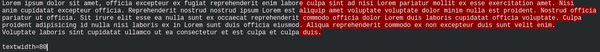

# overlength.nvim

overlength.nvim is a small plugin for Neovim to highlight the part of a line that
doesn't fit into textwidth (or really, whatever width you like).



This plugin is inspired by the Vim plugin
[overlength.vim](https://github.com/tjdevries/overlength.vim) developed by TJ
DeVries ([@tjdevries](https://github.com/tjdevries)). And it also uses some tips
from "Vim Tips Wiki" article ["Highlight long
lines"](https://vim.fandom.com/wiki/Highlight_long_lines).

## Installation

Neovim version >= 0.7.0 is necessary to use this plugin.

Install this plugin using your favorite plugin manager. For example, using
[packer](https://github.com/wbthomason/packer.nvim):

```lua
use 'lcheylus/overlength.nvim'
```

To get started with the default configuration, add:

```lua
require('overlength').setup()
```

## Configuration

While the defaults should work for most users out of the box, the following
options can be configured as such:

```lua
require('overlength').setup({
   -- Overlength highlighting enabled by default
  enabled = true,

  -- Colors for OverLength highlight group
  colors = {
    ctermfg = nil,
    ctermbg = 'darkgrey',
    fg = nil,
    bg = '#8B0000',
  }

  -- Mode to use textwidth local options
  -- 0: Don't use textwidth at all, always use config.default_overlength.
  -- 1: Use `textwidth, unless it's 0, then use config.default_overlength.
  -- 2: Always use textwidth. There will be no highlighting where
  --    textwidth == 0, unless added explicitly
  textwidth_mode = 2,
  -- Default overlength with no filetype
  default_overlength = 80,
  -- How many spaces past your overlength to start highlighting
  grace_length = 1,
  -- Highlight only the column or until the end of the line
  highlight_to_eol = true,

  -- List of filetypes to disable overlength highlighting
  disable_ft = { 'qf', 'help', 'man', 'packer', 'NvimTree', 'Telescope', 'WhichKey' },
})
```

You could change the colors used to highlight too long lines:


```lua
require('overlength').setup({ colors = { bg='#592929' } })
```

## Usage

The plugin creates 3 user-commands:
- `OverlengthEnable` : enable highlights for too long lines
- `OverlengthDisable` : disable highlights for too long lines
- `OverlengthToggle` : turn on/off highlights for too long lines

You can change overlength used for a specific filetype with `set_overlength`
function:

```lua
:lua require('overlength').set_overlength(python, 100)
```

If you want disable overlength highlight for a specific filetype, set overlength
to 0 (or add it to `disable_ft` option in setup):

```lua
:lua require('overlength').set_overlength(markdown, 0)
```
